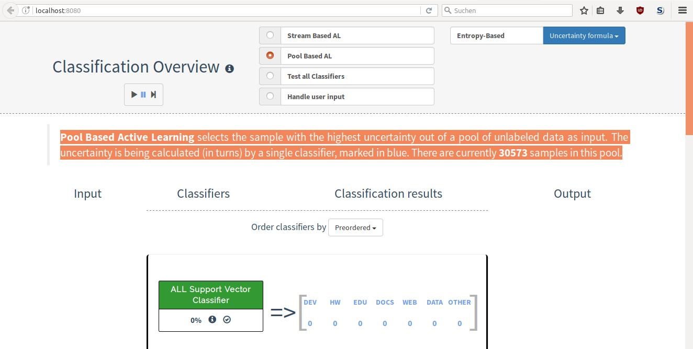
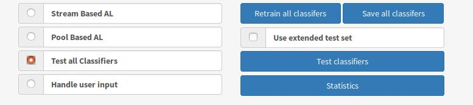
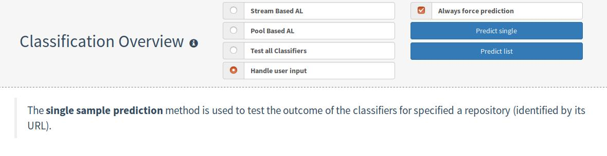

# Frontend Manual

## Modis Overview
1. Stream Based Active Learning 
2. Pool Based Active Learning
3. Test All Classifiers
4. Handle User Input

### 1. Stream Based Active Learning

&nbsp; 

This mode selects a random sample out of your pool of unlabeled data, if a classifier is uncertain, 
so you will be asked and you can categorize it to one of the classes. 
After doing this the sample will shift to a labeled pool used for the training of the classifiers. 
For starting press the 'PLAY'-Button and you will be asked until you click on the 'PAUSE'-Button. 
For a single classification use the 'SKIP NEXT'-Button.

### 2. Pool Based Active Learning

&nbsp;

This mode picks a sample with the highest uncertainty for one classifier (blue marked one) out of the pool of unlabed data. 
Uncertainty will be computed via one of the selected formulas.
For starting press the 'PLAY'-Button and you will be asked until you click on the 'PAUSE'-Button. 
For a single classification use the 'SKIP NEXT'-Button.

### 3. Test All Classifiers

&nbsp;

Here you can refresh the statistics as well as a shortcut for retraining and saving all classifiers.
'Test classifiers' lets all classifiers categorize a pool of testdata given by Informaticup 2017 
(but labeled according to your classification rules) for calculating how accurate every works,
 thus it is shown with confusion matrix and accuracy per class.
'Extended Test Set' is a bigger pool of testdata selected from us 
and can be used for testing if you activate the checkbox.
You will find more information about the testing- and train-pool under the section 'Statistics'.

### 4. Handle User Input

&nbsp;

