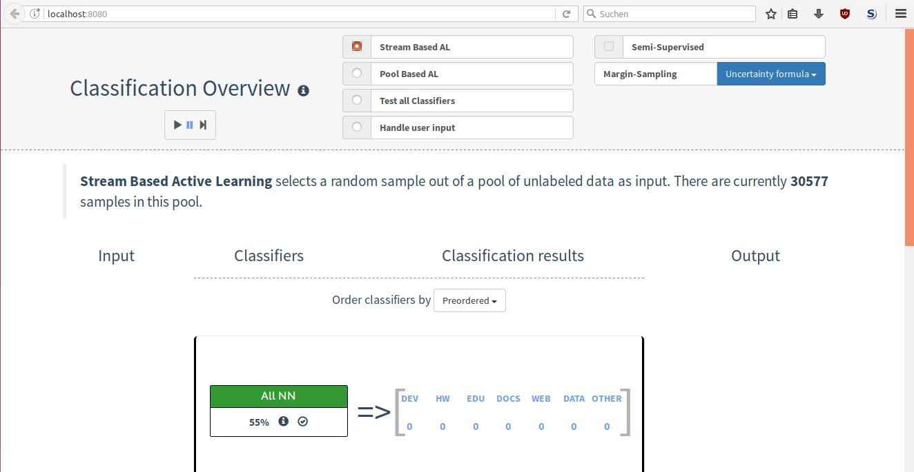

# Frontend Manual

## Modis Overview
1. Stream Based Active Learning 
2. Pool Based Active Learning
3. Test All Classifiers
4. Handle User Input

### 1. Stream Based Active Learning

&nbsp; 

This mode give you a sample out of your pool of unlabeled data, so you can categorize it to one of the classes. 
After doing this the sample will shift to a labeled pool used for the training of the classifiers. 
For starting press the 'PLAY'-Button and you will be asked until you click on the 'PAUSE'-Button. 
For a single classification use the 'SKIP NEXT'-Button.

