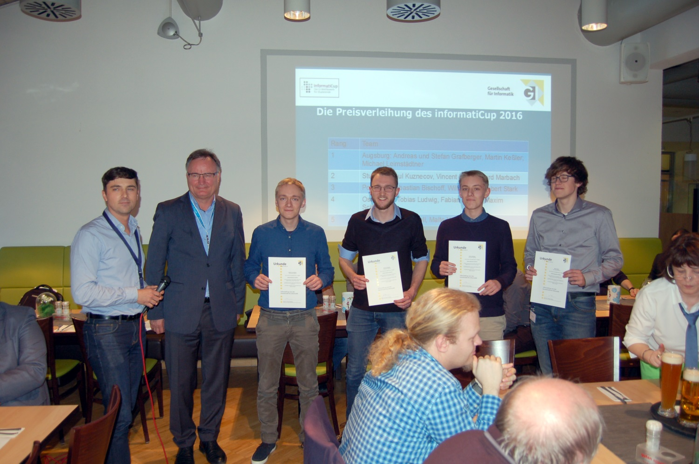

# GitHub Classifier

_Note: Open [UserManual.html](UserManual.html) with [Firefox 50](https://ftp.mozilla.org/pub/firefox/releases/50.1.0/) for a better Markdown representation._

## Introduction

Welcome to the InformatiCup 2017 submission from the team of the **University of Augsburg**.
Please note that this repository doesn't contain our trained classifier save-files. Training them on your own can take really long (1h+) 
and due to the non-deterministic nature of the traing process of most models, results can vary greatly. We recommend using [the save-files from our submission](https://drive.google.com/drive/folders/0B3nBoE608aQyaG9iZkk0UFFpSm8).

## Update 13.03.17: We did it!

  
   
  Photo credit: GI

Yeah! We have been chosen the winning team of the InformatiCup 2017 challenge, what a great honor. Time to say thank you to:

* The Gesellschaft für Informatik to host and organize such a great challenge - keep it up!
* The chair of Organic Computing with Jörg Hähner
* The sponsoring companies
* Moreover: Our competitors - we saw many great solutions back at the BTW, it was nice meeting you!

See you next year :-)

## Classification Goals and Restrictions

GitHub is a place where everyone is able to create new repositories, and nobody is asked to keep them assignable to **one and only one** class given by the InformatiCup guidelines. As a matter of facts, we chose not to make our life easy and had long discussions for many train samples - and labeled them based on nuances, which won't be easy to imitate by a machine learning tool. The very first 5 train samples per class have been given by the _Appendix A_, which we then increased with both **Stream Based** and **Pool Based** [Active Learning](https://en.wikipedia.org/wiki/Active_learning_(machine_learning)). As we kept classifying manually, we saw that a grand part of our input samples would possibly fit in two or more classes (for instance DOCS and EDU) - it is therefore unlikely to reach a near perfect precision score.

Over the time we tried out many different approaches to use varying algorithms on partitions of our feature set. We could observe a _natural limitation_ for single classifiers at precisions around ~ 60%. **For comparison only**:

* Assume every sample would basically fit into two classes, but has been manually classified as one of those
* Random classification would reach 1/7 precision, thus 14% accuracy
* If the classifier would identify the two possible classes and chose a random one, precision would be 50%
* 60% would mean in this abstract example, that possible classes are being spotted and the classifier tends to the correct class

This comparison is far from being close to reality, but does justice to the underlying **evaluation problem**.

To surpass that boundary of ~ 60%, we made use of an [Ensemble learning module](https://en.wikipedia.org/wiki/Ensemble_learning) that combines the decisions of other modules to a final, more accurate one. All that combined - **AL**, modularisation, a train set with > 2000 samples and **Ensemble Learning** brought us to a total F-score M (each class weighted equally) of ~ 65%.

_You can read further about our goals in **Documentation/Documentation.md** or open the file **Documentation.pdf** for a bundled documentation._

## Component Correlation

Because of the need of a shared information base and the dependency on the [GitHub API](https://developer.github.com/v3/), we decided to **encapsulate** a few **main concepts** and connect them through few well defined interfaces. This leaves us basically with a remote backend system and multiple client applications.

### The Backend

Whenever we gather information for a repository, about 10-100 of GitHub's `API-calls` (limited to 5000) are being used. In order to get along with this limitation we decided to set up an isolated **remote** [LAMP](https://en.wikipedia.org/wiki/LAMP_(software_bundle)) server which is able to _mine_ and store random repositories in a dedicated `MySQL database`. This gives us the freedom to work on and extend the same information base while running different clients in separated networks.

_More about the database structure and PHP services can be read in **Documentation/API.md**._

### The Client Application

The software actually containing the classification modules, feature extraction and GUI representation is located inside the  `./Application` folder and can be run **OS-independent** on your **local** machine. It is designed following the [MVC](https://en.wikipedia.org/wiki/Model%E2%80%93view%E2%80%93controller) pattern with Python running the heartbeat and [Bottle](https://en.wikipedia.org/wiki/Bottle_(web_framework)) offering services and files to the Frontend. The best of all: New classifiers can be easily embedded into the system just by being added to `Models/ClassificationModules`.

The frontend is where all the fun starts, so don't hesitate following the Installation Guideline - there is an introduction to the GUI as well in **Documentation/Frontend Manual.md**.

### Client Installation

> Please select **Documentation/Installation Manual.md** on top of the page to get the Frontend running.
