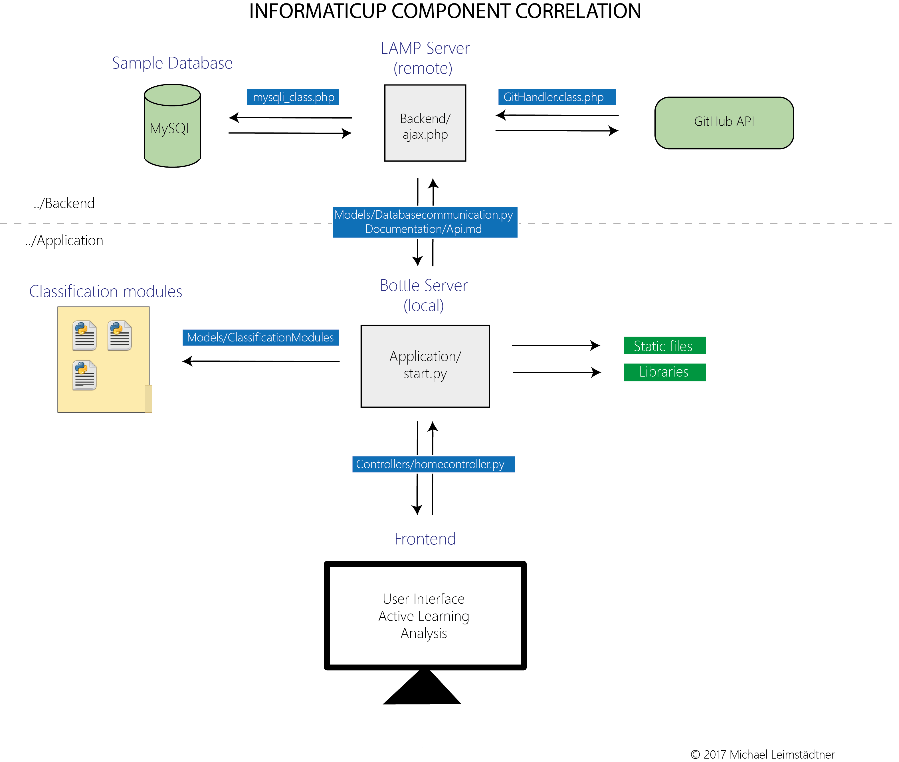

# GitHub Classifier

_Note: Open UserManual.html for a better Markdown representation._

## Introduction

Welcome to the InformatiCup 2017 submission from the team of the **University of Augsburg**.

Over the last couple of months, we tried to develop an easy to use and - wherever applicable - generalised tool for both training and testing purposes of classification tasks. In the early stages, we had to decide where to put most of our efforts in and what to aim for. Thus, we would like to introduce you to our aims before letting you dive into our visualisations and results.

## Classification Goals and Restrictions

## Component Correlation

